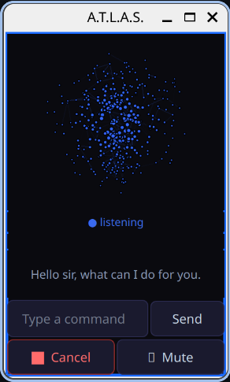
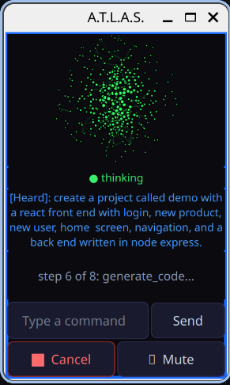
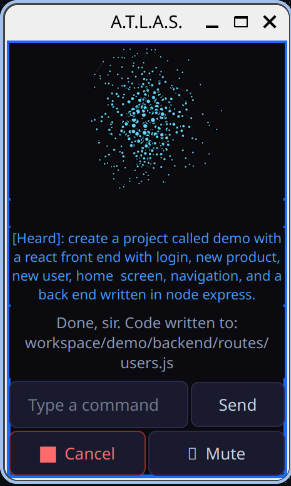
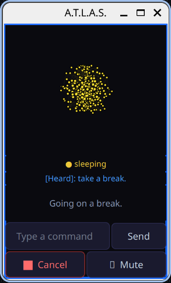
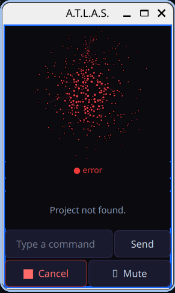

# A.T.L.A.S.
### Autonomous Task and Local AI System

A fully local, voice-controlled AI assistant for Linux — inspired by the AI assistants 
of science fiction, built for the real world. Runs completely on your own hardware with 
no data leaving your machine by default. Optionally connects to Claude and Gemini APIs 
for long-context reasoning and real-time information — always with your explicit permission.

---

## Why Atlas?

Most voice assistants send your data to the cloud. Atlas runs entirely 
on your hardware — your conversations, your files, your code never leave 
your machine. Cloud models are available but always opt-in and always 
announced before use.

---

## GUI

The GUI is a PyQt5 window with a vispy 3D particle orb embedded above a control panel.

### Orb States
| State | Color | Animation |
|-------|-------|-----------|
| Listening | Blue | Slow gentle pulse |
| Thinking | Green | Medium pulse, more particles |
| Speaking | Light blue | Fast pulse |
| Sleeping | Yellow | Very slow deep breath, sparse particles |
| Error | Red | Rapid jitter |

The orb features per-particle color variation, depth-based size variation, and beam line connections between nearby particles for a holographic look. Each state has distinct particle density, breathing speed, and connection density.

<div align="center">
  
  
  
  
  
</div>


> Orb particle colors are defined in `face.py` `COLORS` dict. 
> GUI chrome colors are configurable via `config.yaml` under the `gui` section.

### Caption Area
Displays real-time status as Atlas works:
```
Classifying...
Planning...
Step 1 of 3: create_dir...
Step 2 of 3: generate_code...
Waiting for confirmation...
Done, code written to: workspace/project/file.js
```
Shows spoken text when Atlas is speaking, clears automatically after.

---

## Overview

Atlas is built around a layered intelligence architecture:

1. **Fast keyword layer** — instant response for known commands (open apps, wake words, pause)
2. **phi3:mini** — handles simple conversational questions directly, escalates everything else
3. **Mistral 7B** — orchestrates complex multi-step tasks and generates structured execution plans
4. **DeepSeek Coder 6.7B** — dedicated code generation model, handles all code files
5. **Cloud APIs** — Claude and Gemini available for long-context reasoning and real-time information (opt-in, permission required)
6. **LLaVA** — local vision model, analyzes webcam frames for object identification, 
   scene description, and text reading

All core functionality runs **completely locally** on your machine. No data leaves your computer unless you explicitly approve it.

---

## Feature Roadmap

### Complete
- [x] Voice input (Whisper + Faster-Whisper hybrid STT)
- [x] Voice output (Piper TTS) with British male voice, speed and pitch control
- [x] PyQt5 GUI with embedded vispy 3D particle orb
- [x] Five orb states — listening, thinking, speaking, sleeping, error
- [x] Per-particle color variation and depth-based size variation
- [x] Beam line connections for holographic look
- [x] Smooth sin-wave breathing animation per state
- [x] Real-time caption display — Brain status and spoken text
- [x] Cancel button — stops current task instantly
- [x] Mute button — toggles microphone
- [x] Text input field — type commands directly
- [x] Wake word / sleep commands
- [x] Fast keyword command layer
- [x] App launching
- [x] Browser control (Playwright) with scroll, zoom, click, navigate, YouTube
- [x] Context-aware keyboard shortcuts
- [x] Ollama local LLM integration
- [x] phi3:mini fast classifier with ESCALATE guardrails
- [x] Mistral orchestrator with structured JSON plans
- [x] Dynamic context window sizing based on command complexity
- [x] DeepSeek Coder for all code generation (Python, JS, HTML, CSS, Dart, etc.)
- [x] Tool execution layer (files, folders, code, browser, web search)
- [x] Privacy-first API permission system
- [x] Hallucination and echo loop filters
- [x] Echo cancellation (ears paused during TTS + buffer flush)
- [x] Plan → Confirm → Execute flow with live step progress in GUI
- [x] File overwrite confirmation
- [x] Cancel between execution steps
- [x] Command queue — speak next command while Brain is working
- [x] "One moment please" for slow Brain responses
- [x] Dynamic noise floor calibration (auto-adjusts to environment every 20s)
- [x] ALSA stream recovery with exponential backoff
- [x] Stream lock preventing concurrent mic access crashes (SIGABRT/SIGSEGV)
- [x] DeepSeek explanation stripper — fluff auto-commented at bottom of file
- [x] Gemini API routing
- [x] Claude API routing
- [x] Google calendar integration and control
- [x] Camera integration to view and assess real scenarios
- [x] Screen / vision support (LLaVA)
- [x] Config-driven GUI colors — border, background, text, buttons all configurable via config.yaml

### Planned
- [ ] Add way user wants to be addressed to config.yaml (sir, ma'am, John, Jane, etc.)
- [ ] Self-expanding fast keyword layer
- [ ] RAG over local notes and files
- [ ] Summarize PDF
- [ ] Summarize screenshot
- [ ] Research topic 
- [ ] Android client over SSH
- [ ] FastAPI server
- [ ] Flutter app - Mobile use for Android and iOS
- [ ] Persistent memory and user preferences
- [ ] Push-to-talk mode
- [ ] Gmail integration and control
- [ ] Slack alerts
- [ ] Text alerts
- [ ] Follow-up commands
- [ ] n8n integration
- [ ] Function Gemma - live data; weather, stock prices, etc.
- [ ] Mac and PC versions
- [ ] Camera add more features
  - [ ] Gemini Vision fallback — for complex analysis
  - [ ] "analyze this diagram"
  - [ ] "what's wrong with this code" ← hold code up to camera
  - [ ] "summarize this document"
  - [ ] Use mobile phone's camera     

---

## Project Structure

```
A.T.L.A.S/
├── main.py                  # Entry point — PyQt5 app + async Observer thread
├── config.yaml              # Your local config (gitignored)
├── config.example.yaml      # Template config to share
├── custom_exceptions.py     # PermissionRequired, ModelUnavailable, PlanExecutionError
├── workspace/               # Where Atlas creates files (gitignored)
├── config/
│      └── api_keys.py      # Secure API key management via OS keyring
├── modules/
│   ├── app_launcher.py      # Fast keyword-based app launching
│   ├── brain.py             # LLM routing and plan generation
│   ├── browser_controller.py # Playwright browser automation
│   ├── calendar_module.py   # Google calendar - check schedule and add events
│   ├── ears.py              # Microphone input with dynamic noise calibration
│   ├── eyes.py              # Webcam vision with LLaVA
│   ├── face.py              # PyQt5 GUI — orb, captions, controls
│   ├── observer.py          # Main loop — listens, routes, responds, command queue
│   ├── tool_executor.py     # Executes plans (create files, run scripts, etc.)
│   ├── tts.py               # Text-to-speech (Piper)
│   └── stt/
│       └── hybrid_stt.py    # Speech-to-text (Whisper + Faster-Whisper)
```

---

## Platform Support

| Feature | Linux | Mac | Windows |
|---------|-------|-----|---------|
| Core AI/LLM | ✅ | ✅ | ✅ |
| Voice I/O | ✅ | ✅ | ⚠️ |
| File/code tools | ✅ | ✅ | ✅ |
| App launching | ✅ | ⚠️ | ⚠️ |
| Browser control | ✅ | ✅ | ✅ |
| GUI | ✅ | ✅ | ✅ |

⚠️ = works with minor path configuration

**Mac:** App paths in `app_launcher.py` are Linux paths — update to `/Applications/...` style. Replace `xdg-open` with `open`.

**Windows:** Not recommended — use a VM instead. `xdg-open` doesn't exist, all app paths break, PyAudio installation is painful.

---

## System Requirements

- Linux (tested on Pop!_OS with COSMIC desktop)
- Python 3.11+
- 16GB RAM minimum
- GPU optional (NVIDIA recommended) — falls back to CPU automatically
- Microphone (headset strongly recommended — internal mics pick up background noise)
- Speakers or headphones

---

## Running Atlas

```bash
source .venv/bin/activate
python main.py
```

Atlas will calibrate the microphone noise floor, open the GUI, then say **"Hello sir, what can I do for you"** when ready.

---

### Controls
| Control           | Function                                         |
|-------------------|--------------------------------------------------|
| Voice input       | Handles command and speaks response back         |
| Text input + Send | Type commands directly, bypasses voice           |
| Cancel button     | Stops current task, returns to listening         |
| Mute button       | Toggles microphone on/off, turns red when active |

---

## Voice/Text Commands

### Wake / Sleep
| Say | Result |
|-----|--------|
| `Atlas` or `you there` | Wake from sleep |
| `take a break` or `pause` | Go to sleep |

### Confirm / Cancel
| Say                                         | Result                            |
|---------------------------------------------|-----------------------------------|
| `yes`, `yeah`, `do it`, `go ahead`          | Confirm pending action            |
| `cancel`, `stop`, `never mind`, `forget it` | Cancel current action             |
| `overwrite`, `over write`, `replace`        | Confirm overwriting existing file |

### Apps
| Say | Result |
|-----|--------|
| `open pycharm` | Launches PyCharm |
| `open vscode` | Launches VS Code |
| `open browser` | Launches browser |
| `open terminal` | Launches terminal |

### Files & Folders
| Say | Result |
|-----|--------|
| `create a file called notes.txt` | Creates `workspace/notes.txt` |
| `create a folder called projects` | Creates `workspace/projects/` |
| `create a folder called api with a file called routes.py` | Multi-step plan |

### Code Generation
| Say | Result |
|-----|--------|
| `create a python file called calculator.py with add and subtract methods` | Generates working Python class |
| `create a file called backend.py with flask routes` | Generates Flask app |
| `create a homepage.html with about and contact sections using inline css` | Generates styled HTML page |
| `create a folder called bot with a file called bot.py that has an AI assistant class` | Multi-step with code generation |

### Web & Browser
| Say                                   | Result                         |
|---------------------------------------|--------------------------------|
| `google latest AI news`               | Opens browser, searches Google |
| `youtube classical music`             | Opens YouTube search           |
| `navigate to github.com`              | Opens URL directly             |
| `scroll down` / `go down`             | Scroll page down               |
| `scroll up` / `go up`                 | Scroll page up                 |
| `go back` / `go forward`              | Browser navigation             |
| `refresh` / `reload`                  | Reload page                    |
| `new tab` / `close tab`               | Tab management                 |
| `click first result`                  | Clicks first search result     |
| `zoom in` / `zoom out` / `zoom reset` | Page zoom                      |
| `full screen`                         | Toggle fullscreen              |

### Keyboard Shortcuts (Context-Aware)
| Say | Result |
|-----|--------|
| `save` | Ctrl+S |
| `copy` / `paste` | Ctrl+C / Ctrl+V |
| `undo` / `redo` | Ctrl+Z / Ctrl+Shift+Z |
| `find` | Ctrl+F |
| `select all` | Ctrl+A |
| `close` | Ctrl+W |

### Conversation & Facts
| Say                            | Result                                                  |
|--------------------------------|---------------------------------------------------------|
| `what's the capital of France` | Instant answer via phi3                                 |
| `tell me a joke`               | Dry British wit                                         |
| `how are you today`            | Atlas responds in character                             |
| `what can you do`              | Atlas responds dynamically with enabled features listed |

---

### Calendar
| Say                                     | Result                               |
|-----------------------------------------|--------------------------------------|
| `what do I have today`                  | Today's events                       |
| `what's on my schedule today`           | Today's events                       |
| `what do I have tomorrow`               | Tomorrow's events                    |
| `what's on my calendar tomorrow`        | Tomorrow's events                    |
| `what do I have this week`              | Events for next 7 days               |
| `upcoming events`                       | Events for next 7 days               |
| `when is my next meeting`               | Next upcoming event                  |
| `what's next`                           | Next upcoming event                  |
| `add meeting friday at 2pm`             | Create event — parsed directly       |
| `add meeting friday at 2pm for 2 hours` | Create event with duration           |
| `schedule a meeting tomorrow at 9:30am` | Create event                         |
| `add an event`                          | Guided flow — Atlas asks for details |

### Calendar Setup
Atlas uses Google Calendar API with OAuth2. On first use a browser window will open for Google login. Approve access and the token is saved permanently — never asked again.

Credentials and token are stored outside the project:
```
~/.config/atlas/google_calendar_credentials.json  ← download from Google Cloud Console
~/.config/atlas/google_calendar_token.json        ← created automatically on first login
```

### Vision (Eyes)
| Say | Result |
|-----|--------|
| `what do you see` | Describes full scene |
| `what can you see` | Describes full scene |
| `what's on my desk` | Describes workspace |
| `what's behind me` | Describes background |
| `what am I holding` | Identifies object |
| `what is this` | Identifies object |
| `read this` | Transcribes visible text |
| `what does this say` | Transcribes visible text |
| `read the text on screen` | Reads monitor/screen text |
| `is anyone there` | Detects people in frame |
| `how many people` | Counts visible people |
| `what am I doing` | Describes activity |
| `what color is this` | Identifies colors |
| `do you see a phone` | Answers yes/no vision questions |
| `is there a X` | Answers yes/no vision questions |
| `does this look right` | General vision question |

### Vision Setup
Atlas uses your webcam and LLaVA running locally via Ollama.
```bash
ollama pull llava
pip install opencv-python
```

### GUI Customization

Atlas's name and all GUI colors are configurable in `config.yaml` — no code changes needed.
```yaml
personalize:
  ai_assistant_name: "A.T.L.A.S."
gui:
  border_color: "#1a6aff"      # window border color
  border_width: 2              # border thickness in pixels
  background_color: "#0a0a0f"  # main background
  text_color: "#c8d8e8"        # primary text
  caption_color: "#8a9ab8"     # caption/status text
  heard_color: "#4499ff"       # "heard" transcription label
  button_bg: "#1a1a2e"         # button background
  button_border: "#2a2a4e"     # button border
  button_hover: "#2a2a4e"      # button hover background
```

### Notes
- Title bar color is controlled by your desktop compositor (COSMIC, GNOME, etc.) — not configurable via Qt on Wayland
- Canvas background updates automatically from `background_color`
- Restart Atlas after changing colors
- Window positioning and always-on-top not supported under Wayland by design
- On COSMIC desktop: right-click titlebar → Sticky to pin above other windows
- On X11: window position saves automatically every 5 seconds and restores on next launch

---

## Architecture: How a Command Flows

```
Your voice
    ↓
Whisper STT — transcribes audio to text
    ↓
Hallucination filter — drops repetitive/too-short/echo audio
    ↓
Fast keyword layer (AppLauncher)
    ├── matched → execute instantly (open app, wake, pause, cancel)
    └── no match ↓
Command Queue — voice keeps listening while Brain processes
    ↓
phi3:mini classifier
    ├── simple fact/conversation → answer directly (~2-4 seconds)
    └── ESCALATE ↓
Mistral orchestrator
    ├── generates JSON execution plan (dynamic ctx: 1024–8192)
    ├── speaks summary → "Shall I proceed, sir?"
    ├── waits for voice confirmation
    └── confirmed ↓
ToolExecutor
    ├── create_file, create_dir
    ├── generate_code → DeepSeek Coder writes actual code
    ├── read_file, run_script, list_dir, delete_file
    └── web_search, browser_navigate, browser_search
```

---

## Command Queue

Atlas processes commands concurrently — voice keeps listening while Brain is working. Say a second command while Atlas is executing the first and it will be queued and processed immediately after.

```
"create a flask app"  →  Brain starts working
"what's 5 times 5"   →  queued while Brain works
                         answered immediately after first command finishes
```

Commands are processed one at a time in order — no commands are dropped.

---

## Dynamic Context Windows

Mistral's context window scales automatically based on command complexity:

| Command Type | ctx | Example |
|---|---|---|
| Simple (≤10 words) | 1024 | "create a file called hello.txt" |
| Medium (≤20 words) | 2048 | "create a folder called projects" |
| Code task (≤15 words) | 4096 | "create a flask file with routes" |
| Complex code (>15 words) | 8192 | "create a flask backend with auth and database models" |
| Complex multi-step | 4096 | long commands with and/then/also |

---

## Noise Floor Calibration

Atlas automatically calibrates microphone thresholds at startup and every 20 seconds:

- Uses the **95th percentile** of samples — handles AC/fan spikes better than mean
- Dynamically sets `start_threshold` and `stop_threshold` based on your environment
- Prints results: `[Ears] Noise floor=1842 start=7368 stop=3684`
- Warns if noise floor exceeds 5000 RMS and uses conservative static thresholds
- Stream lock prevents concurrent calibration and listening from causing ALSA crashes

**Tip:** A headset or USB microphone dramatically improves accuracy in noisy environments.

---

## Plan → Confirm → Execute

For any command that involves executing steps, Atlas will:

1. **Speak the plan** — "Creating flask folder with backend.py inside."
2. **Ask for confirmation** — "Shall I proceed, sir?"
3. **Wait for your response** — say yes/yeah/do it/go ahead to confirm, anything else cancels
4. **Execute** — runs each step, updates GUI caption with live progress, checks for cancel between steps
5. **Report** — "Done, sir. Code written to workspace/backend.py"

**File exists?** Atlas says "backend.py already exists, sir. Say overwrite to replace it." Say overwrite/replace/yes to proceed or anything else to keep the existing file.

**Slow response?** If Brain takes more than 5 seconds, Atlas says "One moment please, sir." and continues working.

---

## Setup Checklist

### System Dependencies
- [ ] Python 3.11+
- [ ] `pip` and `venv`
- [ ] `ffmpeg` — required by Whisper for audio processing
  ```bash
  sudo apt install ffmpeg
  ```
- [ ] `portaudio` — required for microphone input
  ```bash
  sudo apt install portaudio19-dev
  ```
- [ ] Playwright system dependencies
  ```bash
  playwright install firefox
  playwright install-deps
  and/or then update config.yaml 'use_chrome: true', 'use_firefox: false'
  playwright install chromium
  playwright install-deps
  ```

### Ollama + Local Models
- [ ] Install Ollama
  ```bash
  curl -fsSL https://ollama.com/install.sh | sh
  ```
- [ ] Pull Mistral (orchestrator)
  ```bash
  ollama pull mistral
  ```
- [ ] Pull phi3:mini (fast classifier)
  ```bash
  ollama pull phi3:mini
  ```
- [ ] Pull DeepSeek Coder (code generation)
  ```bash
  ollama pull deepseek-coder:6.7b
  ```
- [ ] Verify models are running
  ```bash
  ollama list
  ollama run mistral "say hello"
  ollama run phi3:mini "say hello"
  ollama run deepseek-coder:6.7b "say hello"
  ```

### Python Environment
- [ ] Create and activate virtual environment
  ```bash
  python -m venv .venv
  source .venv/bin/activate
  ```
- [ ] Install Python dependencies
  ```bash
  pip install ollama
  pip install openai-whisper
  pip install faster-whisper
  pip install piper-tts
  pip install pyaudio
  pip install simpleaudio
  pip install numpy
  pip install scipy
  pip install PyQt5
  pip install playwright
  pip install pyyaml
  pip install pytest-asyncio
  pip install anthropic               # Claude API (optional)
  pip install google-genai            # Gemini API (optional)
  ```
- [ ] Install Playwright browser
  ```bash
  playwright install chromium
  ```

### Configuration
- [ ] Copy and edit config
  ```bash
  cp config.example.yaml config.yaml
  ```
- [ ] Set `audio.use_mock: false` for real microphone
- [ ] Set `system.use_gpu: true` if you have a compatible NVIDIA GPU (sm_61+)

### API Keys (Optional)
- [ ] Anthropic (Claude) — https://console.anthropic.com
- [ ] Google (Gemini)  — https://console.cloud.google.com
- [ ] Set `api_models.claude.enabled: true` and/or `api_models.gemini.enabled: true` in config to activate

Prompted for API key on first run. Simply paste it into the GUI. Stored securely in keychain for future use.
### Workspace
- [ ] `workspace/` directory is created automatically on first run
- [ ] Add to `.gitignore`:
  ```
  workspace/
  .venv/
  config.yaml
  .window_pos
  ```
  ### Browser Profile (First Run)
Atlas uses your browser profile to have access to your accounts, history, log-ins, saved profiles, etc.

None of this is stored or shared with anyone. Your data remains secure and private.

To use Chrome instead, update config.yaml:
```yaml
browser:
  use_chrome: true
  use_firefox: false
  chrome_profile_path: "/home/{user}/.config/google-chrome/atlas"
```

---

## config.yaml Reference

```yaml
# ---- Personalize ----
personalize:
  ai_assistant_name: "A.T.L.A.S."
  # response_name: 'sir' -- allow user to change to 'ma'am', 'john', 'jane', etc.
  # home_city: "New York"  -- for what's the weather and local based responses

gui:
  # window border
  border_color: "#1a6aff"        # light blue
  border_width: 3
  # title bar / window chrome
  title_color: "#0a1a4a"         # dark blue
  # background
  background_color: "#0a0a0f"
  # text colors
  text_color: "#c8d8e8"
  caption_color: "#8a9ab8"
  heard_color: "#4499ff"
  # button colors
  button_bg: "#1a1a2e"
  button_border: "#2a2a4e"
  button_hover: "#2a2a4e"

# ---- Node identity ----
node:
  name: "{device name}"
  role: "{device role}" # single_node | observer | brain | hands

# ---- Networking (future use) ----
network:
  brain_ip: "127.0.0.1"
  brain_port: 8000
  hands_ip: "127.0.0.1"
  hands_port: 8001
  observer_ip: "127.0.0.1"
  observer_port: 8002

# ---- LLM (disabled for now) ----
llm:
  enabled: true
  # local | remote
  backend: "local"

  models:
    classifier:
      name: phi3:mini
      # contextual tokens adjust dynamically. increase for more base power at expense of speed
      num_ctx: 2048
      # deterministic - no creativity needed, just classify
      temperature: 0.0
      # hard output cap - 3 sentence max - increase for longer responses from phi3 (basic AI)
      max_tokens: 300

    orchestrator:
      name: mistral
      # contextual tokens adjust dynamically. increase for more base power at expense of speed
      num_ctx: 8092
      # low-medium - consistent JSON output, handles varied phrasing
      temperature: 0.2
      max_tokens: 500

    code:
      # deepseek-r1 - Deep system analysis
      name: deepseek-coder:6.7b
      # contextual tokens adjust dynamically. increase for more base power at expense of speed
      num_ctx: 8092
      # nearly deterministic - correct code over creative code
      temperature: 0.1

  api_models:
    claude:
      enabled: false
      model: claude-opus-4-6
      max_tokens: 1000
      ask_permission: true
    gemini:
      enabled: true
      model: gemini-2.5-flash
      ask_permission: true
  
# ---- Integrations ----
integrations:
  google_calendar:
    enabled: true
    credentials_path: "~/.config/atlas/google_calendar_credentials.json"
    token_path: "~/.config/atlas/google_calendar_token.json"

# ---- Memory ----
memory:
  enabled: false # enable later when adding FAISS
  vector_db_path: "./memory/vector_db/"
  short_term_db: "./memory/short_term.db"
  recall_top_k: 5

# ---- Audio ----
audio:
  samplerate: 16000
  # Max length of message that can be heard in seconds
  duration: 30
  mic_index: null
  use_mock: false
  calibration_interval: 30
  # give up waiting to START speaking after 3s
  pre_speech_timeout: 3.0
  # hard cap — allows long commands
  max_speech_duration: 25.0
  # wait 1.5s of silence before stopping mid-speech
  silence_seconds: 1.5

transcription:
  engine: faster-whisper

# ---- Speech ----
tts:
  # mock TTS
  enabled: false
  engine: "coqui"
  voice: "default"


# ---- Camera vision ----
vision:
  enabled: true
  camera_index: 0
  model: llava
  max_storage_mb: 500
  resolution_width: 1280
  resolution_height: 720


# ---- Execution permissions ----
permissions:
  allow_file_write: true
  # safer default
  allow_command_exec: false
  allow_network: false

# ---- Logging ----
logging:
  level: "INFO"
  file: "./logs/atlas.log"

# ---- Development ----
dev:
  mock_mode: false
  auto_approve: false

stt:
  language: en
  # Length of message that can be heard in seconds
  duration: 30
   # tiny | base | small | medium | large
  whisper_model: small
  # tiny | base | small | medium | large
  fw_model: small

system:
  cpu_threads: {number of threads}
  use_gpu: true

browser:
  profile: "atlas"
  chrome_profile_path: "/home/{user}/.config/google-chrome/atlas"
  use_chrome: false
  firefox_profile_path: "/home/{user}/.mozilla/firefox/atlas"
  use_firefox: true
```

---

## Troubleshooting

**Atlas mishears commands**
- Speak clearly and at a moderate pace
- For file extensions say "dot p y" not "dot py"
- Consider upgrading Whisper model from `small` to `medium` in config
- A headset mic dramatically reduces background noise issues

**"Max speech duration reached" constantly firing**
- Background noise exceeds your start threshold
- Check `[Ears] Noise floor=...` in logs — if above 5000, environment is very noisy
- Increase `start_multiplier` in config (default 4.0, try 5.0 or 6.0)
- A headset mic is the most reliable fix

**ALSA/SIGABRT/SIGSEGV crashes**
- Stream accessed concurrently — ensure `_stream_lock` is in place in ears.py
- Disable `auto_calibrate` temporarily to confirm it's the source
- Restart audio: `systemctl --user restart pipewire pipewire-pulse wireplumber`

**Mic not found after audio crash**
- Run: `systemctl --user restart pipewire pipewire-pulse wireplumber`
- ears.py falls back to `pulse` device automatically if analog mic isn't found

**Response is very slow**
- Expected on CPU — 7B models take 20-30 seconds without GPU
- Simple questions via phi3 should be 2-4 seconds
- Code generation via DeepSeek takes 30-90 seconds on CPU
- GPU upgrade (sm_61+) is the most impactful hardware improvement

**phi3 trying to handle computer tasks itself**
- ESCALATE keyword triggers fallthrough to Mistral
- Code block detector in `quick_answer()` catches most cases
- Add examples to phi3 system prompt for edge cases

**File created with explanation text instead of code**
- DeepSeek added commentary — the stripper handles this automatically
- Explanation lines are commented out at bottom of file, not deleted
- Check `[ToolExecutor] ⚠️ Stripped N lines` in logs

**Mistral returning truncated JSON**
- Dynamic ctx sizing handles this automatically
- Check `[Brain] num_ctx:` log line
- If still occurring, increase manually in config

**"Shall I proceed" confirmation not heard**
- Ears resumes after TTS — speak clearly after Atlas finishes asking
- If misheard, it will cancel — just repeat the command or type yes in text box and click send

**GUI window position not saving**
- Position save/restore only works on X11 — not supported under Wayland by design
- On COSMIC desktop: right-click titlebar → Sticky to pin the window

**GUI loads in the middle of the screen**
- Expected on Wayland — compositor controls window placement
- Drag to preferred position and use compositor sticky/pin feature

---

## Running Tests
```bash
source .venv/bin/activate
pytest tests/ -v
```

### Test Structure
```
tests/
├── conftest.py              # shared fixtures — mock config, mock audio, fake Observer
├── test_brain.py            # LLM routing, plan generation, context window sizing
├── test_calendar_module.py  # checks schedule, adds events, verifies correct parsing 
├── test_ears.py             # noise calibration, hallucination filters
├── test_eyes.py             # webcam capture, LLaVA analysis, storage monitoring
├── test_launcher.py         # launching and controlling apps
├── test_observer.py         # command routing, cancel, confirmation flow
├── test_tool_executor.py    # file creation, code generation, plan execution
└── test_stt.py              # transcription, echo detection.
```

### Running Specific Tests
```bash
pytest tests/test_brain.py -v          # brain tests only
pytest tests/test_tool_executor.py -v  # tool executor only
pytest -k "test_cancel" -v             # any test with "cancel" in the name
pytest -x                              # stop on first failure
```

### Test Coverage
```bash
pip install pytest-cov
pytest tests/ --cov=modules --cov-report=term-missing
```

---

## Privacy

- All processing is **local by default** — nothing leaves your machine
- Cloud API calls (Claude, Gemini) are **disabled by default**
- When enabled, Atlas **asks permission before every API call**
- Anthropic and Google do not use API calls to train their models by default

---

## Credits

## Credits

Built with: Ollama, Whisper, Faster-Whisper, Piper TTS, simpleaudio, PyAudio, PyQt5, vispy, scipy, Playwright, NumPy, PyYAML, LLaVA, Google Calendar API, google-auth, opencv-python, keyring, phi3:mini, Mistral 7B, DeepSeek Coder 6.7B, Gemini 2.5 Flash